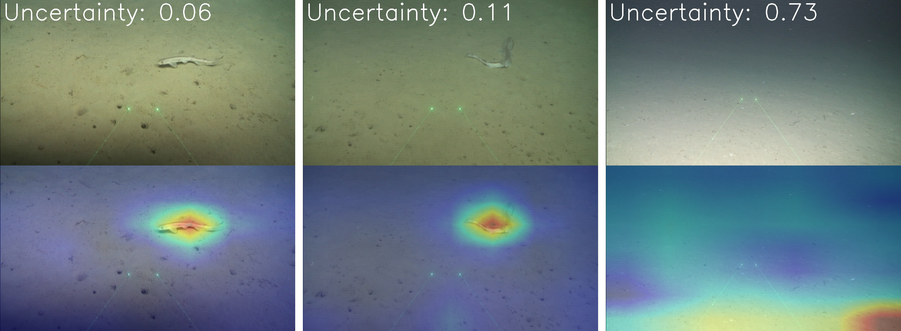

## Uncertainty as a Proxy of the Generalization Error for Marine Species Identification

Repo still in progress...

Thesis Dissertation at: [[here](imgs/TDM_David.pdf)]



### Introduction

Marine Protected Areas monitoring is a must to understand ecological processes and assess whether management aims are
fulfilled. One of the best ways of doing it is by using a Remotely Operated Underwater Vehicle to collect images.
However, the main drawback is the large amount of data that has to be annotated by specialists. In this thesis, we
propose to go one step further and use a deep learning system to maximize the system's performance while reducing the
human workload. The algorithm reports, in addition to the deterministic decision, uncertainty estimations to identify
potential misclassifications. However, evaluating the model doubtfulness is not trivial and, therefore, we test several
well-known and a novel metric which evaluates the quality of the estimations regarding its ranking. Furthermore, we
propose a systematic method to reduce the workload from non-annotated datasets, using uncertainty as a proxy of the
generalization error and automatically labelling with the model the most certain samples.

In this repository, we implement several well-known uncertainty metrics and the novel Uncertainty Ordering Curve (UOC)
which evaluates the uncertainty estimating regarding its ranking. UOC is a monotone increasing curve created by plotting the
accuracy against the percentage of corrected samples ranked by uncertainty in descending order.

Furthermore, we propose two model wrappers to ease the computation of uncertainty estimations with MC dropout method and Class
Activation Maps with a wide variety of techniques.

### Installation
```commandline
git clone https://github.com/davidserra9/UncertaintyasProxy.git
```

#### Requirements
```commandline
cd Uncertainty-as-Proxy
pip install -r requirements.txt
```

#### Usage Examples

- Uncertainty estimation and CAMs on test images using the model wrappers ([notebook](examples/wrappers_inference.ipynb)).
- Model and uncertainty evaluation on a trained model ([notebook](examples/evaluation.ipynb))

### Citing the work
If you find the paper useful in your research, please consider citing:

```
```


